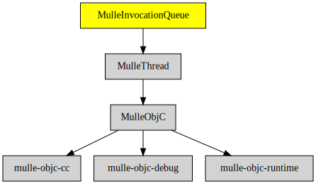

# MulleInvocationQueue

#### 🚶🚶🚶 MulleInvocationQueue runs methods in a separate thread

A MulleInvocationQueue is fed with NSInvocations, which it then executes in
serial fashion in a separate thread.


| Release Version                                       | Release Notes
|-------------------------------------------------------|--------------
|  [](//github.com/MulleFoundation/MulleInvocationQueue/actions) | [RELEASENOTES](RELEASENOTES.md) |


## MulleInvocationQueue

You create a queue on **your** current thread

``` objc
   queue = [MulleInvocationQueue alloc];
   queue = [queue initWithCapacity:128
                     configuration:MulleInvocationQueueMessageDelegateOnExecutionThread];
   queue = [queue autorelease];
```

Then you feed the invocation queue with invocations still from **your** thread.
These invocations need not be to methods, written in a threadsafe manner, as
long as the target is now exclusively used by the **MulleInvocationQueue** until
all invocations are processed:


``` objc
      invocation = [NSInvocation mulleInvocationWithTarget:foo
         selector:@selector( printUTF8String:), s];

      [queue addInvocation:invocation];
```

It is not necessary, but it will likely be helpful to mark the last invocation
as the "final" invocation. This could be a `-close` on a `NSFilehandle` for
example:

``` objc
   invocation = [NSInvocation mulleInvocationWithTarget:foo
      selector:@selector( printUTF8String:), s];

   [queue addFinalInvocation:invocation];
```

With `[queue start]` the queue is now executing in parallel with the calling
thread.


## Requirements

|   Requirement         | Release Version  | Description
|-----------------------|------------------|---------------
| [MulleThread](https://github.com/MulleFoundation/MulleThread) |  [](https://github.com/MulleFoundation/MulleThread/actions/workflows/mulle-sde-ci.yml) | 🍝 MulleThread sleeps until nudged
| [MulleFoundationBase](https://github.com/MulleFoundation/MulleFoundationBase) |  [](https://github.com/MulleFoundation/MulleFoundationBase/actions/workflows/mulle-sde-ci.yml) | 🧱 MulleFoundationBase amalgamates Foundations projects
| [mulle-objc-list](https://github.com/mulle-objc/mulle-objc-list) |  [](https://github.com/mulle-objc/mulle-objc-list/actions/workflows/mulle-sde-ci.yml) | 📒 Lists mulle-objc runtime information contained in executables.

### You are here



## Add

Use [mulle-sde](//github.com/mulle-sde) to add MulleInvocationQueue to your project:

``` sh
mulle-sde add github:MulleFoundation/MulleInvocationQueue
```

## Install

Use [mulle-sde](//github.com/mulle-sde) to build and install MulleInvocationQueue and all dependencies:

``` sh
mulle-sde install --prefix /usr/local \
   https://github.com/MulleFoundation/MulleInvocationQueue/archive/latest.tar.gz
```

### Legacy Installation

Install the requirements:

| Requirements                                 | Description
|----------------------------------------------|-----------------------
| [MulleThread](https://github.com/MulleFoundation/MulleThread)             | 🍝 MulleThread sleeps until nudged
| [MulleFoundationBase](https://github.com/MulleFoundation/MulleFoundationBase)             | 🧱 MulleFoundationBase amalgamates Foundations projects
| [mulle-objc-list](https://github.com/mulle-objc/mulle-objc-list)             | 📒 Lists mulle-objc runtime information contained in executables.

Download the latest [tar](https://github.com/MulleFoundation/MulleInvocationQueue/archive/refs/tags/latest.tar.gz) or [zip](https://github.com/MulleFoundation/MulleInvocationQueue/archive/refs/tags/latest.zip) archive and unpack it.

Install **MulleInvocationQueue** into `/usr/local` with [cmake](https://cmake.org):

``` sh
cmake -B build \
      -DCMAKE_INSTALL_PREFIX=/usr/local \
      -DCMAKE_PREFIX_PATH=/usr/local \
      -DCMAKE_BUILD_TYPE=Release &&
cmake --build build --config Release &&
cmake --install build --config Release
```

## Author

[Nat!](https://mulle-kybernetik.com/weblog) for Mulle kybernetiK  


